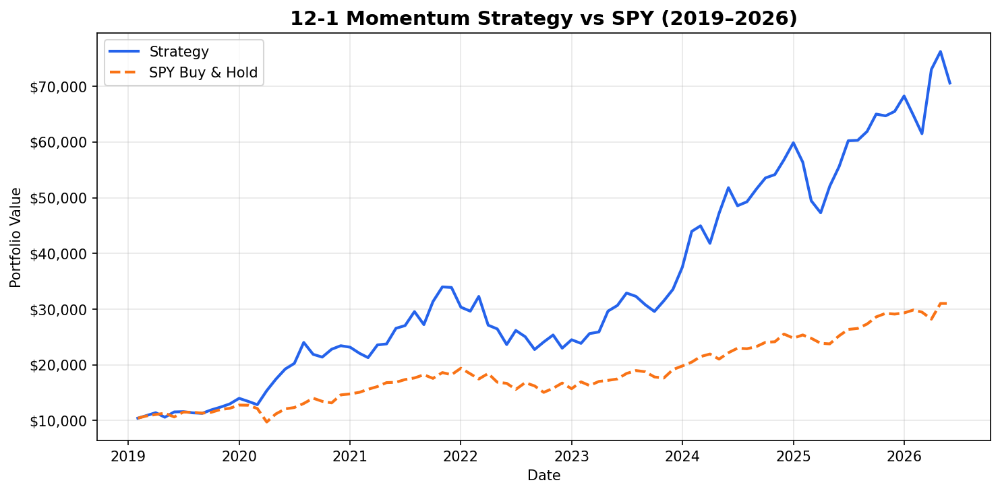

# End-to-End Quant Momentum Trading System



A fully automated momentum trading system built in Python. Backtests a 12-1 momentum strategy from 2018 to today, calculates risk-adjusted performance metrics, visualises results in an interactive dashboard, and executes live paper trades via the Alpaca brokerage API.

---

## Strategy

**12-1 Momentum** ranks stocks by their return over the past 12 months, skipping the most recent month:

```
score = price[t-21] / price[t-252] - 1
```

- `t-252` = 12 months ago (252 trading days)
- `t-21`  = 1 month ago (21 trading days, the "skip")

The most recent month is skipped because very recent winners tend to briefly reverse before continuing upward — a well-documented effect in academic literature (Jegadeesh & Titman, 1993).

Each month, the top 3 stocks by momentum score are held in equal weight, subject to risk rules.

---

## Performance

| Metric | Strategy | SPY (Buy & Hold) |
|---|---|---|
| CAGR | 29.80% | 16.03% |
| Sharpe Ratio | 0.98 | — |
| Max Drawdown | -33.07% | — |
| Win Rate | 62.50% | — |

*Backtest period: Feb 2019 – Jul 2026 | Starting capital: $10,000*

---

## Project Structure

```
quant-momentum-trader/
├── data_loader.py          # downloads price data via yfinance
├── strategy.py             # 12-1 momentum scoring and stock selection
├── risk.py                 # position limits, cash buffer, drawdown kill switch
├── backtester.py           # monthly simulation loop
├── metrics.py              # CAGR, Sharpe, drawdown, win rate
├── dashboard.py            # interactive Streamlit dashboard
├── paper_trade_alpaca.py   # live paper trading via Alpaca API
├── requirements.txt
└── results/
    ├── equity_curve.png
    └── performance_report.csv
```

---

## Installation

```bash
git clone https://github.com/aryankh2006/quant-momentum-trader.git
cd quant-momentum-trader
pip install -r requirements.txt
```

---

## Usage

**Run the backtest:**
```bash
python3 backtester.py
```

**View performance metrics:**
```bash
python3 metrics.py
```

**Launch the dashboard:**
```bash
streamlit run dashboard.py
```

**Run paper trading (requires Alpaca API keys):**
```bash
# 1. create a .env file with your keys:
echo "ALPACA_API_KEY=your_key" >> .env
echo "ALPACA_SECRET_KEY=your_secret" >> .env

# 2. run with DRY_RUN=True first to preview orders
python3 paper_trade_alpaca.py
```

---

## Risk Management

Three rules are applied every month before any order is placed:

1. **Kill switch** — if the portfolio drops more than 15% from its peak, go to 100% cash until it recovers
2. **Position cap** — no single stock can exceed 40% of the portfolio
3. **Cash buffer** — always keep 10% in cash (max 90% invested)

---

## Limitations

- **Small universe** — only 8 tickers. A real momentum strategy would run across hundreds of stocks.
- **Survivorship bias** — all 8 tickers are still trading today. Stocks that went bankrupt between 2018 and now are not included, which makes the backtest look better than reality.
- **No slippage model** — we subtract a flat 0.1% per trade, but real slippage varies and can be higher for less liquid stocks.
- **Paper trading only** — live trading introduces execution risk, tax considerations, and regulatory requirements not modelled here.
- **Single regime** — the backtest covers mostly a bull market. Performance in a prolonged bear market may differ significantly.

---

## Tech Stack


- **Data**: yfinance (Yahoo Finance)
- **Strategy & backtesting**: pandas, numpy
- **Visualisation**: Streamlit, Plotly
- **Live trading**: Alpaca paper trading API
- **Environment**: python-dotenv
